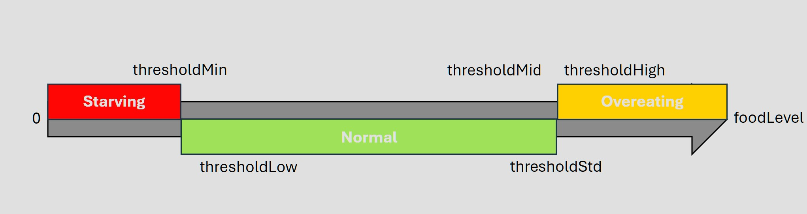

## What is that
A mod changes player hunger and saturation system.
It also has 3 layer of food bar, the *Starving*, *Normal* and *Overeating*.
Make life HARD, and enjoyable cause it gained your food mods importance.


## Use
Could Run in client and both side.

## Key Differences
**Pros**
- Back to RTL food bar.
- Food's nutrition changes to 5x *default* with small randomizer.
- Automatic food bar scale.
- Lost saturation level on movement and even you standstill.
- Can be configured with [Customize Settings](#Config).
- No extra mod library needed.
- No other food mod changes required.
- Almost no mod do with `HungerManager.class`, cause this mod should works with others, well.
**Cons**
- Removed sleeptight support.
- Removed farmer delight support.
- Only Minecraft version 1.21.1.
- Only Fabric.

## Config
Locate your config in Minecraft installation location:
`%APPDATA%\.minecraft\config\saturative_overhaul.json` on Windows, default location.
You will get somethings like that:
```
{
	"foodLevel":400,
	"defaultFoodLevel":280,
	"nutritionModifier":5,
	"nutritionRandLow":0.8,
	"nutritionRandHigh":1.2,
	"saturationRandLow":0.8,
	"saturationRandHigh":1.2,
	"thresholdStd":300,
	"thresholdMin":25,
	"thresholdLow":100,
	"thresholdMid":250,
	"thresholdHigh":350
}
```
It's easy:

"foodLevel":400
Max level that you can have.

"defaultFoodLevel":280
New player or after-death etc default level.

"nutritionModifier":5
To help you gain food level,
if you got a food add `2` as vanilla does
this mod just make `2` to nearly *`10`*[See Code](src/main/java/dev/emilahmaboy/felixagairu/saturative_overhaul/mixin/HungerManagerMixin.java)
to help you play with this mod.

All 4 settings also for that:
Also make life random not static:
"nutritionRandLow"
For nutrition random low limit.
"nutritionRandHigh"
For nutrition random upper limit.
"saturationRandLow"
For saturation random low limit.
"saturationRandHigh"
For saturation random upper limit.
[See Code](src/main/java/dev/emilahmaboy/felixagairu/saturative_overhaul/tools/LimitRandomizer.java)

"thresholdStd":300
Between this and `thresholdMin`, GUI show **Normal** Layer

"thresholdMin":25
Lower, GUI show **Starving** Layer
Make your more slow and nausea

"thresholdLow":100
Make your more likely to hunger and tired
And make you move slow

"thresholdMid":250
Make your likely to hunger and tired

"thresholdHigh":350
Lager, GUI show **Overeating** Layer
SLOW! NAUSEA! Why You Eat So Much?


## Bugs
- Apple skin support almost break miss match the values with GUI.
- ...

## Original
[Saturative](https://github.com/EmilAhmaBoy/saturative) by EmilAhmaBoy
